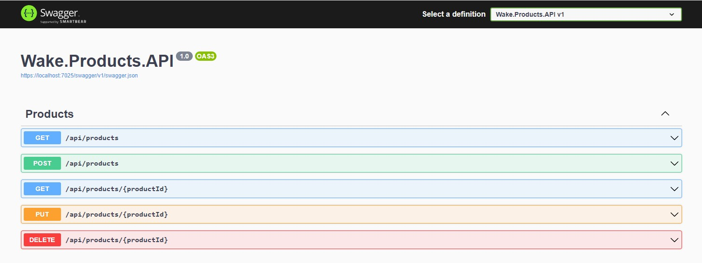

# API de Produtos - WAKE

API foi documentada com o Swagger:



## Resumo da API:

API de produtos com 5 funcionalidades: 

- **Obter produtos com base em um filtro, com opções de ordenação**
    - Filtragem pelos principais campos
    - Opções de ordenação por qualquer campo desejado
    - Ordenação pode ser ASC ou DESC
- **Criar um novo produto**
    - O nome do produto deve ter no máximo 100 caracteres
    - O nome do produto deve ter no mínimo 2 caracteres
    - A descrição do produto deve ter no máximo 200 caracteres
    - O valor e o estoque do produto não podem ser negativos
- **Obter um produto específico**
    - Busca pelo ID
- **Atualizar um produto**
    - Atualiza qualquer informação do produto que não seja enviada como NULL no payload
- **Exclusão (Lógica) de um Produto**
    - Desativa o produto no banco de dados, mantendo-o como histórico para auditoria

## Requisitos para executar o projeto no Windows:

- [Visual Studio - Download](https://visualstudio.microsoft.com/pt-br/downloads/)
- [GIT para Windows - Download](https://git-scm.com/download/win)
- [Docker Desktop - Download](https://www.docker.com/products/docker-desktop/)
- SGBD Postgres de sua preferência. No meu caso, estou usando o Beekeeper.
  - [Download do Beekeeper](https://www.beekeeperstudio.io/get)

## Inicializando o Projeto

Escolha um diretório de sua preferência e clone o projeto:
```
git clone https://github.com/BrunoHBastiani/Wake.git
```
Garanta que o Docker está em execução para os próximos passos:

1. Execute o comando `docker-compose up -d` na raiz da solução, onde é encontrado o arquivo docker-compose.yml.
2. Defina o projeto **Wake.Products.Data** como Projeto de Inicialização.
3. Abra o Package Manager Console no Visual Studio com o **Wake.Products.Data** como projeto padrão.
4. Execute o comando `Update-Database` para aplicar a migração no banco de dados.
5. Defina o projeto **Wake.Products.API** como Projeto de Inicialização.
6. Execute o projeto usando HTTPS.

Para validar se tudo deu certo, a API deve ser compilada e iniciada sem erros, e você conseguirá conectar-se ao banco de dados utilizando estas credenciais:

      USUÁRIO: admin
      SENHA: admin
      BANCO DE DADOS: wakedb

## Decisões de desenvolvimento do Projeto

Este projeto foi desenvolvido idealizando um cenário real, onde me imaginei desenvolvendo um sistema para um e-commerce, decidindo quais arquitetura, padrões de projeto e outras características de projeto eu iria usar.
A partir deste cenário, adicionei alguma complexidade ao projeto para que pudesse simular cenários de pico de uso do sistema, como ocorre na black friday, por exemplo.

Tendo isso em mente, optei por seguir com a Arquitetura Limpa, onde o foco da aplicação é no domínio, onde as camadas internas desconhecem as camadas externas. Também segui os princípios SOLID e alguns princípios do DDD, como domínios ricos, para uma melhor organização e para separar corretamente o que é uma complexidade de negócio e o que é uma complexidade técnica, e utilizando padrões de desenvolvimento simples como o repository para desacoplar e abstrair o banco de dados.

Uma alternativa interessante para esse caso seria a utilização do padrão arquitetural CQRS, onde a camada de dados é segregada em Commands (modificações no banco de dados) e Queries (buscas no banco de dados), pois além de evitar a bagunça da camada de dados no código durante a sua evolução, também é possível utilizar um banco de dados e/ou um ORM diferente para cada uma das duas camadas propostas. Neste caso, utilizaria o DAPPER como ORM na camada de busca e teria a liberdade de otimizar as consultas, pois poderia trazer um desempenho melhor nesse cenário crítico.

Também desenvolvi este projeto pensando em uma possível migração para microsserviços. Portanto, desenvolvi a API em módulos separados, totalmente desacoplada de qualquer outra API que possa ser criada futuramente na evolução do produto.


## Entity Framework e .NET

Projeto desenvolvido com EF Core e .NET Core 8.0, utilizando Code First, onde eu modelo minhas entidades e mapeio elas informando o nome que devem ter na base e algumas outras características, e a partir delas, o EF Core gera o banco de dados.
Utilizei o Code First para criar a base já populada com cinco produtos.

## Explicação dos Projetos

**Minha solução está dividida em 4 camadas:**

- **Application**
    - Esta camada representa a lógica de aplicação, responsável pelas funcionalidades do sistema. 
- **Domain**
    - Esta camada representa o núcleo da minha aplicação, onde estão centralizadas as principais entidades e lógica de negócio da minha aplicação.
- **Infrastructure**
    - Esta camada representa as informações de infraestrutura do sistema, bem como configurações de ambiente e serviços externos. Utilizei essa camada para a configuração do meu banco de dados e repositories.
- **Web**
    - Esta camada representa a apresentação, onde o usuário interage diretamente ou indiretamente com o sistema. Utilizei essa camada para a implementação da minha API de produtos.

**Também criei dois projetos para demonstrar alguns testes simples:**

- **Wake.Products.UnitTests**
    - Responsável por testar as lógicas de negócio e de aplicação, bem como as unidades dentro do sistema.
- **Wake.Products.IntegrationTests**
    - Responsável por testar as integrações do sistema, como a integração das funcionalidades da API, bem como as funcionalidades voltadas para o banco de dados.

## GitHub Actions

O workflow foi configurado para ser acionado sempre que é feito um "push" na master. Está configurado para realizar o build da aplicação e executar os testes unitários e de integração, sempre utilizando o .NET 8.0.x.
